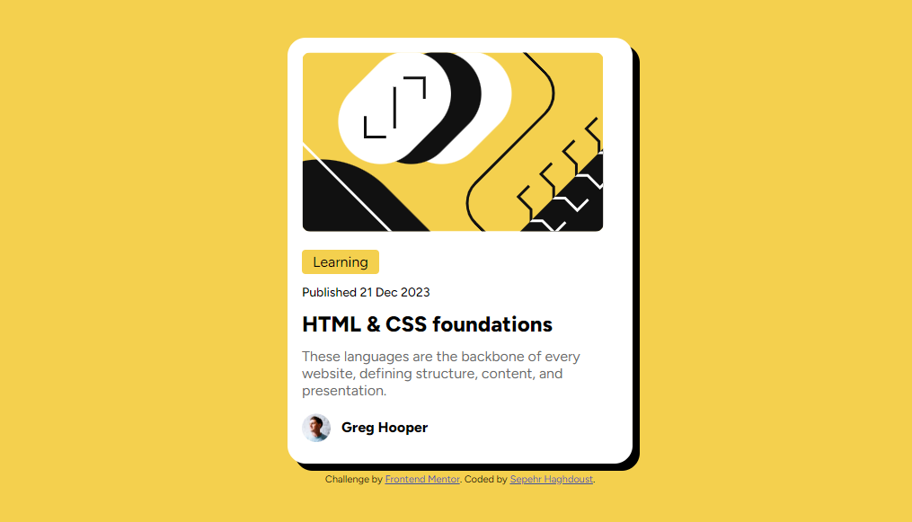

# Frontend Mentor - Social links profile solution

This is a solution to the [ Blog preview challenge on Frontend Mentor](https://www.frontendmentor.io/challenges/blog-preview-card-ckPaj01IcS). Frontend Mentor challenges help you improve your coding skills by building realistic projects.

## Table of contents

- [Overview](#overview)

  - [The challenge](#the-challenge)
  - [Screenshot](#screenshot)
  - [Links](#links)

  - [Built with](#built-with)

- [Author](#author)

## Overview

### The challenge

Users should be able to:

- See hover and focus states for all interactive elements on the page

### Screenshot

### Links

- Solution URL: [github](https://github.com/sepehrsylvanus/blog-preview)
- Live Site URL: [Netlify](https://blog-preview-sepehr.netlify.app/)

### Built with

- CSS custom properties
- Flexbox
- Grid

## Author

- Website - [Sani dev.](sani-dev-portfolio.vercel.app)
- Frontend Mentor - [@sepehrsylvanus](https://www.frontendmentor.io/profile/sepehrsylvanus)
